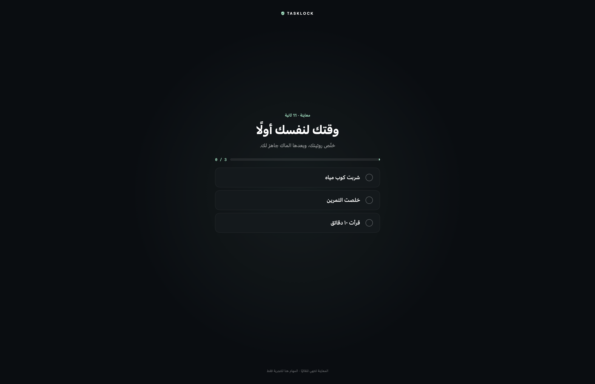

# TaskLock

### خلّص روتينك اليومي قبل ما تبدأ على الكمبيوتر

تطبيق للماك وويندوز يعرض مهامك في منتصف شاشة تغطي سطح المكتب. أنجز المهام بعيدًا عن الكمبيوتر، ثم علّم على كل مهمة؛ يختفي الحاجز بعد حفظ إكمال القائمة كلها.

**بدون حسابات، بدون سيرفر، وبدون مزامنة سحابية. بيانات الروتين محفوظة على جهازك.**

[تحميل مباشر من فولدر Download](download/) · [English documentation](README.en.md) · [صفحة الإصدارات](https://github.com/TZacksEG/TaskLock/releases) · [الإبلاغ عن مشكلة](https://github.com/TZacksEG/TaskLock/issues) · [حالة الاختبارات](docs/Release-status.md)



*الصورة من معاينة تطبيق الماك بمهام تجريبية. ليست صورة لنسخة ويندوز، ولا تعني أن فلترة الإدخال اختُبرت على كل جهاز.*

> **الإصدار الحالي: 1.1.0-beta.1 — تجريبي.** نسخة الماك غير موثّقة من Apple، ونسخة ويندوز غير موقّعة بشهادة ناشر ولم تُجرّب على جهاز ويندوز فعلي بعد. اقرأ حالة النسخ قبل تفعيل روتينك.

## المحتويات

- [الفكرة والاستخدام المناسب](#الفكرة-والاستخدام-المناسب)
- [التحميل والتوافق](#التحميل-والتوافق)
- [المميزات](#المميزات)
- [التثبيت على الماك](#التثبيت-على-الماك)
- [التثبيت على ويندوز](#التثبيت-على-ويندوز)
- [كيف يعمل الروتين اليومي](#كيف-يعمل-الروتين-اليومي)
- [التشغيل التلقائي والسكون](#التشغيل-التلقائي-والسكون)
- [الخصوصية وتخزين البيانات](#الخصوصية-وتخزين-البيانات)
- [حدود القفل والاسترداد](#حدود-القفل-والاسترداد)
- [حالة الاختبارات](#حالة-الاختبارات)
- [البناء من المصدر](#البناء-من-المصدر)
- [هيكل المشروع](#هيكل-المشروع)
- [حل المشكلات](#حل-المشكلات)
- [التحديث والحذف](#التحديث-والحذف)
- [المساهمة والتراخيص](#المساهمة-والتراخيص)

## الفكرة والاستخدام المناسب

TaskLock يساعدك تلتزم بروتينك قبل الانشغال بالكمبيوتر. أمثلة مناسبة: شرب الماء، الحركة، ترتيب المكتب، قراءة كتاب ورقي، أو إنهاء عادة صباحية.

اختر مهامًا تستطيع تنفيذها **بعيدًا عن الجهاز**. المهمة التي تحتاج متصفحًا أو برنامجًا على نفس الجهاز لا تناسب حاجزًا يمنع استخدامه. التطبيق يعتمد على تأكيدك أنت؛ وضع علامة على المهمة لا يثبت أنه تم تنفيذها خارج الكمبيوتر.

ابدأ بقائمة قصيرة وجرب المعاينة قبل التفعيل. التطبيق لا يبدأ بمهام مفروضة: كل تثبيت جديد يبدأ بقائمة فارغة وروتين غير مفعّل.

## التحميل والتوافق

افتح [صفحة الإصدار 1.1.0-beta.1](https://github.com/TZacksEG/TaskLock/releases/tag/v1.1.0-beta.1) واختر الملف المناسب من **Assets**:

| جهازك | الملف | حالة النسخة |
|---|---|---|
| Mac بمعالج Apple Silicon أو Intel، macOS 14 فأحدث | [تحميل نسخة Mac](download/Mac/) | حزمة Universal؛ توقيع محلي ad-hoc، بدون توثيق Apple |
| Windows بمعالج Intel أو AMD ‏64-bit | [تحميل Windows x64](download/Windows/TaskLock-1.1.0-beta.1-Windows-x64-experimental-beta.zip) | بناء تجريبي؛ التشغيل الفعلي على ويندوز غير مختبر |
| Windows على معالج ARM64 | [تحميل Windows ARM64](download/Windows/TaskLock-1.1.0-beta.1-Windows-arm64-experimental-beta.zip) | بناء ARM64 تجريبي؛ التشغيل الفعلي غير مختبر |

نسختا ويندوز تضمان ملفات .NET اللازمة للتشغيل؛ لا تحتاج تثبيت .NET منفصلًا. ابدأ التجربة على إصدار Windows 11 مدعوم. استهداف واجهات Windows 10 في الكود لا يعني ضمان التوافق مع كل إصدارات Windows 10؛ راجع [أنظمة ويندوز المدعومة من .NET](https://learn.microsoft.com/en-us/dotnet/core/install/windows).

**لاستخدام التطبيق:** نزّل DMG أو ZIP الخاص بجهازك. ملفات **Source code** التلقائية في GitHub مخصصة للمطورين وليست برنامج تثبيت.

كل حزمة تتضمن دليل تثبيت. الإصدار يتضمن أيضًا `SHA256SUMS.txt` للتحقق من سلامة الملفات. تطابق البصمة يثبت سلامة النقل، ولا يحل محل توقيع الناشر.

## المميزات

- **روتين يومي قابل للتعديل:** تضيف مهامك وتختار وقت بداية اليوم؛ الافتراضي منتصف الليل.
- **حفظ التقدم:** كل تأكيد إكمال يُحفظ محليًا قبل اعتباره منجزًا.
- **استمرار الإنجاز:** إغلاق التطبيق أو إعادة تشغيل الجهاز لا يُفترض أن يمسح المهام المكتملة في نفس اليوم.
- **شاشة على كل عرض متصل:** تنفيذ مخصص لتغطية الشاشات، مع إعادة بناء الحاجز عند تغيرها؛ اختبار الأجهزة المتعددة ما زال مطلوبًا.
- **معاينة ١٥ ثانية:** مهام نموذجية، انتهاء تلقائي، دون تغيير قائمتك الحقيقية.
- **تشغيل تلقائي اختياري:** من إعدادات التطبيق، بعد تسجيل الدخول للنظام.
- **واجهة عربية:** قوائم وإعدادات عربية، مع إمكانية كتابة أسماء المهام بلغات أخرى.
- **استرداد عند مشاكل التخزين:** فشل الحفظ يوقف الحاجز ويحافظ على آخر حالة محفوظة بدل تسجيل إنجاز لم يُحفظ.

## التثبيت على الماك

1. نزّل ملف DMG وافتحه.
2. اسحب **TaskLock** إلى **Applications**.
3. أخرج القرص الافتراضي، ثم افتح التطبيق من Applications. أغلق أي نسخة أقدم أولًا.
4. فعّل TaskLock من **System Settings → Privacy & Security → Accessibility**. يحتاج التطبيق هذا الإذن لفلترة الإدخال أثناء الروتين.
5. جرّب **«معاينة ١٥ ثانية»**. بدون Accessibility تختبر المعاينة شكل الشاشة ووضع العرض فقط؛ لا تثبت حجب لوحة المفاتيح.
6. أضف مهامك، واضبط وقت التجديد، ثم اضغط **«حفظ وتفعيل الروتين»**.
7. لو أردت التشغيل التلقائي، فعّل **«تشغيل تلقائي مع دخول الماك»**، ووافق في إعدادات Login Items إذا طلب macOS ذلك.

### لو macOS منع فتح النسخة

هذه النسخة موقعة محليًا فقط وليست موثّقة من Apple. إذا كنت تثق بمصدر الملف، حاول فتحه ثم استخدم **Open Anyway** من **Privacy & Security** عندما يتيحه النظام. لا تعطّل Gatekeeper أو تستخدم أوامر إزالة الحماية. بعض الأجهزة المُدارة قد تمنع فتح النسخة تمامًا.

تغيير نسخة ad-hoc قد يتطلب إعادة منح Accessibility. التفاصيل الفنية ومسار التوقيع والتوثيق المستقبلي في [دليل توزيع الماك](docs/Mac-distribution.md).

## التثبيت على ويندوز

1. اختر x64 أو ARM64 حسب معالج جهازك، وفك ملف ZIP بالكامل.
2. شغّل **`Install.cmd`** للتثبيت في حسابك. لا يحتاج صلاحية Administrator.
3. أو شغّل **`TaskLock.exe`** مباشرة للتجربة المحمولة.
4. جرّب **«معاينة ١٥ ثانية»** قبل الاعتماد على القفل. تنتهي المعاينة تلقائيًا.
5. أضف المهام في السطر الأخير من الجدول، وحدد وقت بداية اليوم.
6. اضغط **«حفظ وتفعيل القفل»** بعد مراجعة المهام.
7. للتشغيل التلقائي، ثبّت التطبيق أولًا ثم فعّل الخيار داخل الإعدادات؛ يحتاج مسارًا ثابتًا للملف.

زر **«حفظ مسودة وتثبيت»** داخل النسخة المحمولة يحفظ ما كتبته كروتين **غير مفعّل**، ثم يفتحه في النسخة المثبتة. راجع القائمة واضغط حفظ وتفعيل بعد ذلك.

المثبت ينسخ التطبيق إلى حسابك ويضيف اختصارًا لقائمة Start؛ لا يضيف خدمة نظام أو إدخال إزالة داخل Apps & Features. الإعدادات والخروج متاحان من أيقونة TaskLock بجوار الساعة بعد إكمال المهام.

### تحذير الناشر في ويندوز

النسخة غير موقعة بشهادة Authenticode، وقد يحذر منها SmartScreen أو تمنعها سياسة الجهاز. لا تعطّل وسائل الحماية. نجاح بناء الملف لا يثبت أن واجهته أو فلترة الإدخال تعمل على جهازك؛ خطوات التجربة موجودة في [قائمة اختبار ويندوز](docs/Windows-testing.md)، وداخل ZIP.

## كيف يعمل الروتين اليومي

| الحالة | السلوك المقصود |
|---|---|
| أول تشغيل | قائمة فارغة وروتين غير مفعّل |
| بعد تفعيل قائمة فيها مهام غير مكتملة | يظهر حاجز المهام |
| إكمال بعض المهام | يُحفظ التقدم ويستمر الحاجز |
| إكمال آخر مهمة وحفظها | يختفي الحاجز |
| إعادة الفتح في نفس اليوم بعد إكمال الكل | يظل الكمبيوتر متاحًا |
| الوصول إلى وقت بداية اليوم التالي | تصبح المهام مطلوبة من جديد |
| تقديم التاريخ عدة أيام | ينتقل مباشرة إلى الدورة الحالية |
| إرجاع الساعة للخلف | لا يمحو الإنجاز أو يرجع الدورة المحفوظة للخلف |
| تغيير اسم مهمة أو إضافة مهمة عند الحفظ | تصبح المهمة الجديدة أو المعدّلة غير مكتملة |
| خطأ حفظ أو ملف بيانات تالف | يُتاح استخدام الجهاز وتظهر حالة الاسترداد |

مثال: لو اخترت **06:30** كبداية اليوم وأكملت الروتين، تظل المهام مكتملة إلى 06:30 في اليوم التالي. المنطق يراعي المنطقة الزمنية المحلية وتغير التوقيت الصيفي. إكمال المهمة يعتمد على الضغط عليها بعد تنفيذها؛ لا توجد كاميرا أو مراقبة لإثبات الإكمال.

## التشغيل التلقائي والسكون

التشغيل التلقائي في النسخ المشتركة **اختياري**، ويحدث بعد دخول حساب المستخدم. TaskLock لا يستبدل كلمة مرور النظام ولا يظهر بدل شاشة تسجيل الدخول.

التنفيذ مصمم لإظهار المهام المتبقية بعد العودة من السكون أو فتح الجلسة، ولترك الجهاز متاحًا إذا كانت مهام اليوم مكتملة. يوقف فلترة الإدخال أثناء انتقالات القفل/السكون. التحقق من غطاء اللابتوب وإعادة التشغيل الفعلية، خصوصًا على ويندوز، ما زال ضمن اختبارات الأجهزة المطلوبة.

## الخصوصية وتخزين البيانات

لا توجد حسابات أو تحليلات استخدام أو اتصالات شبكة داخل التطبيق. لا يرفع الروتين إلى GitHub أو Google Drive. تحميل ملف الإصدار من الإنترنت منفصل عن عمل التطبيق محليًا.

| النسخة | مكان البيانات |
|---|---|
| Mac العام | `~/Library/Application Support/TaskLock-Desktop/routine.json` |
| Windows | `%LOCALAPPDATA%\TaskLock\routine.json` |
| Mac التطوير القديم | `~/Library/Application Support/TaskLock/routine.json` |
| Mac اختبارات المعاينة | `~/Library/Application Support/TaskLock-Testing/` |

يحفظ الملف أسماء المهام، ومعرّفاتها، والمهام المكتملة، ودورة اليوم، ووقت التجديد، وحالة التفعيل. يتم استبداله ذريًا بعد الكتابة الناجحة لتقليل خطر الملف الجزئي. ملفات الماك تُحفظ بصلاحيات المالك فقط؛ تخزين ويندوز يتبع صلاحيات مجلد حساب المستخدم.

لنسخة احتياطية، أغلق التطبيق بعد إنهاء الروتين وانسخ مجلد بيانات منصتك إلى مكان تثق به. لا تنشر ملف `routine.json` في Issue لأنه قد يحتوي على مهام شخصية. **صيغة بيانات الماك وويندوز ليست عقد مزامنة؛ لا تفترض أن نسخ JSON بينهما سيعمل.**

## حدود القفل والاسترداد

TaskLock أداة التزام شخصي، وليس منتج حماية أو قفل نظام يستحيل تجاوزه. لا يثبت الإكمال الحقيقي، ولا يمنع مدير الجهاز أو أدوات الاسترداد من إغلاقه.

- **macOS:** نوافذ AppKit ووضع عرض kiosk وفلتر إدخال للجلسة، مع Accessibility. لا يغيّر خرائط أزرار HID بشكل دائم.
- **Windows:** نوافذ WinForms ومرشحات low-level keyboard/mouse. يظل Ctrl+Alt+Delete وتسجيل الدخول وUAC وأدوات الاسترداد تحت سيطرة ويندوز.
- **فشل التخزين:** يوقف الحاجز ويترك آخر إنجاز محفوظ دون اختلاق حفظ ناجح.
- **تعطل واجهة ويندوز:** صلاحية فلترة الإدخال تحتاج نبضة من الواجهة؛ انتهاء مهلة الثلاث ثوانٍ يوقف الفلترة. التأخر الطويل في خيط المرشحات يبطل جلسة القفل أيضًا.
- **حدود API ويندوز:** قد يزيل النظام مرشحات الإدخال دون إشعار يمكن الاعتماد عليه؛ نبضة الخيط لا تثبت استمرار الحجب. راجع [توثيق Microsoft](https://learn.microsoft.com/en-us/windows/win32/winmsg/lowlevelmouseproc).

إذا حدث عطل، استخدم وسائل الاسترداد المعتادة للنظام. إذا كانت المهام سليمة والتطبيق يعمل طبيعيًا، أكمل الروتين ثم عطّل التفعيل أو اخرج من قائمة التطبيق.

## حالة الاختبارات

| الفحص | النتيجة في 1.1.0-beta.1 |
|---|---|
| اختبارات Swift لمنطق اليوم والتخزين | **18 ناجحة** |
| اختبارات .NET للروتين والتخزين وسياسة النقر | **33 ناجحة على macOS** |
| بناء Mac Universal وتحقق التوقيع المحلي والحزم | ناجح |
| توثيق Apple وقبول Gatekeeper | غير موثّق؛ التقييم المحلي رفض الحزمة |
| تشغيل حقيقي على Intel Mac | غير مختبر |
| فلترة macOS الكاملة مع Accessibility في بيئة البناء | غير متحققة؛ إذن Accessibility لم يُمنح أثناء الاختبار السابق |
| بناء Windows x64 وARM64، فحص PE وموارد الحزمة والبصمات | ناجح |
| تشغيل Windows والواجهة والقفل والتثبيت والسكون والتشغيل التلقائي | **غير مختبر على جهاز ويندوز** |
| تعدد الشاشات وDPI والغطاء وإعادة التشغيل على الأجهزة المستهدفة | يحتاج اختبارًا فعليًا |

مجموع الاختبارات الآلية **51**. راجع [التقرير الكامل](docs/Release-status.md)؛ اختبار المنطق أو سلامة الحزمة لا يعادل اختبار نظام التشغيل.

## البناء من المصدر

### بناء الماك

تحتاج macOS 14+ وXcode كاملًا يتضمن Swift 6 وXCTest. من جذر المشروع:

```sh
DEVELOPER_DIR=/Applications/Xcode.app/Contents/Developer swift test
./script/package_macos.sh
```

الناتج في `outputs/releases/macos/1.1.0-beta.1-unnotarized-beta/`. السكربت يبني arm64 وx86_64 ويجمعهما في تطبيق Universal، وينتج ZIP وDMG وتقرير تحقق وبصمات. لا يثبّت التطبيق ولا يشغله.

لمن يملك Developer ID وملف إعداد Keychain لـ notarytool، يدعم السكربت مسارًا صريحًا للتوقيع والتوثيق. هذا المسار يرفع الحزمة إلى Apple ولم يُختبر بحساب ناشر في هذا الإصدار؛ راجع [التفاصيل](docs/Mac-distribution.md).

### اختبارات وبناء ويندوز

إصدار SDK محدد في `global.json`: **10.0.401** مع السماح بتحديثات patch المتوافقة. لتشغيل اختبارات المنطق:

```sh
dotnet run --project Windows/TaskLock.Core.Tests -c Release
```

على macOS مع Python 3 وSDK المناسب:

```sh
TASKLOCK_DOTNET="$(command -v dotnet)" ./script/package_windows.sh
```

على Windows، للبناء المباشر:

```powershell
dotnet publish Windows/TaskLock.Windows -c Release -r win-x64 --self-contained true -o work/windows-x64
dotnet publish Windows/TaskLock.Windows -c Release -r win-arm64 --self-contained true -o work/windows-arm64
```

أول restore يحتاج الإنترنت لتنزيل حزم البناء والتشغيل. لا يقوم سكربت البناء بتنزيل SDK أو تثبيته تلقائيًا. التطبيق الناتج مستقل عن SDK، ويضم runtime خاصًا به؛ تحديث runtime يحتاج إصدارًا جديدًا من التطبيق. [تفاصيل بناء ويندوز](docs/Windows-distribution.md).

### اختبار الماك المعزول

```sh
./script/build_and_run.sh --test-build
open -n 'work/TaskLock Test.app' --args --smoke-test
# بعد انتهاء الاختبار الأول:
open -n 'work/TaskLock Test.app' --args --storage-failure-test
```

هذه هوية اختبار منفصلة وبياناتها معزولة. `inputGateActive=false` يعني أن الاختبار لم يمارس فلتر الإدخال. تجنب استخدام helper التطوير القديم بوضعه الافتراضي لتجهيز توزيع عام؛ بعض أوضاعه تستبدل نسخة `/Applications/TaskLock.app`. استخدم سكربت التغليف المخصص للتوزيع.

## هيكل المشروع

```text
Sources/TaskLock/             واجهة الماك والتحكم بالنوافذ والإدخال
Sources/TaskLockCore/         منطق الروتين وتخزينه على الماك
Tests/TaskLockCoreTests/      اختبارات Swift
Windows/TaskLock.Core/       منطق ويندوز المستقل عن الواجهة
Windows/TaskLock.Core.Tests/ اختبارات .NET القابلة للتشغيل على الماك
Windows/TaskLock.Windows/    واجهة WinForms والنوافذ ومرشحات الإدخال
Windows/ThirdParty/          تراخيص runtime المرفق
script/                     البناء والتغليف والتحقق
docs/                      أدلة التوزيع والاختبار والصورة
```

الكود منفصل حسب المنصة، مع سلوك روتين متشابه؛ لا يوجد backend مشترك أو طبقة Electron. الحزم الكبيرة تُنشر في Releases، ولا تُضاف إلى سجل المصدر.

## حل المشكلات

| المشكلة | ما تراجعه |
|---|---|
| الماك يمنع فتح التطبيق | حالة النسخة غير الموثقة وخيار Open Anyway إن أتاحه النظام |
| لا يمكن تفعيل الروتين على الماك | إذن Accessibility؛ قد يلزم إغلاق التطبيق وإعادة فتحه بعد منحه |
| ويندوز يمنع EXE | حالة SmartScreen وسياسة الجهاز؛ النسخة بلا توقيع ناشر |
| التشغيل التلقائي لا يعمل | التثبيت أولًا، ثم تفعيل الخيار؛ على الماك تحقق من Login Items أيضًا |
| شاشة القفل لم تظهر بعد إعادة الفتح | تحقق هل كل مهام اليوم مكتملة، وهل الروتين مفعّل |
| بيانات النسخة القديمة لا تظهر على الماك | النسخة العامة لها مجلد بيانات مستقل عن نسخة التطوير |
| ظهر خطأ تخزين | احتفظ بالملف الأصلي، راجع صلاحيات المجلد والمساحة، ثم استخدم إعادة المحاولة |
| تثبيت ويندوز لا ينجح فوق نسخة تعمل | أكمل الروتين وأغلق النسخة السابقة من أيقونتها ثم أعد التثبيت |
| ضغطات أو شاشات تتصرف بشكل مختلف | أرفق إصدار النظام والمعمارية وترتيب الشاشات وDPI في Issue؛ هذه المسارات لم تُختبر على كل الأجهزة |

## التحديث والحذف

**التحديث:** أكمل الروتين، أغلق التطبيق، ثم استبدله بحزمة من نفس قناة الإصدار. تبقى البيانات في مجلد المنصة المستقل عن ملف البرنامج. لا توجد آلية تحديث تلقائي في هذا الإصدار. على الماك قد تحتاج إعادة منح Accessibility بعد تغيير توقيع النسخة.

**حذف الماك:** أوقف التفعيل والتشغيل التلقائي، وأغلق التطبيق، ثم انقله إلى Trash. مجلد بياناتك يبقى محفوظًا.

**حذف ويندوز:** أكمل المهام، واخرج من أيقونة TaskLock، ثم شغّل `Uninstall.cmd` من الحزمة التي فككتها. يزيل البرنامج واختصاره وتسجيل التشغيل التلقائي الخاص به، ويترك بيانات الروتين. حذف مجلد البيانات يدويًا قرار منفصل إذا أردت بداية جديدة.

## المساهمة والتراخيص

لإبلاغ مفيد، اذكر إصدار TaskLock، وإصدار النظام، ونوع المعالج، وخطوات إعادة المشكلة، والسلوك المتوقع والفعلـي. أضف تخطيط الشاشات وDPI عند مشاكل العرض. استخدم مهامًا تجريبية في الصور واحذف أي بيانات شخصية.

قبل اقتراح تعديل، شغّل اختبارات المنصة المناسبة، وبيّن صراحة هل جُرّب على جهاز فعلي أم بُني فقط. اختبارات ويندوز الفعلية والتوقيع والتوثيق ودعم واجهة إنجليزية مجالات عمل مستقبلية؛ ليست ميزات جاهزة في هذا الإصدار.

لم يُحدَّد ترخيص عام لكود المشروع بعد. تراخيص .NET ومكونات الطرف الثالث مرفقة في [Windows/ThirdParty](Windows/ThirdParty)، وتُضمّن داخل حزم ويندوز. لا تضف مفاتيح توقيع أو كلمات مرور أو ملفات مهام شخصية إلى المستودع.
